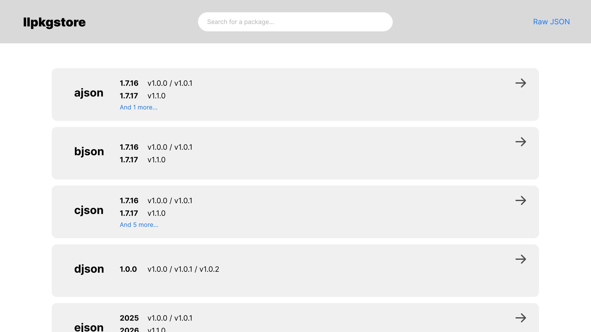
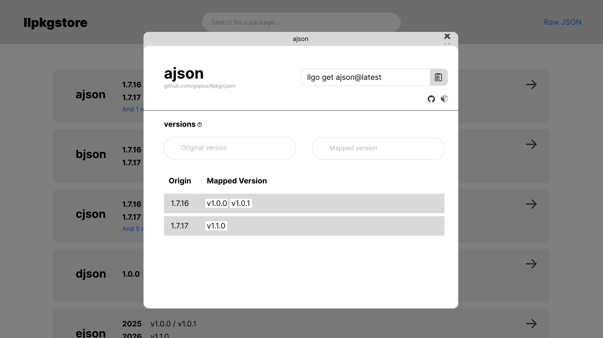

# llpkgstore design

This document provides a high-level overview of the design of **llpkgstore**.

We'll firstly introduce the architecture of llpkgstore, and then discuss how users can interact with the service. Finally, we'll explain the package generation workflow, and provide some crucial details of the implementation.

## Abstract

llpkgstore is designed to be a package distribution service for [**LLGo**](https://github.com/goplus/llgo).

An **llpkg** is a Go module that invokes libraries of other languages through [**LLGo**](https://github.com/goplus/llgo)'s ecosystem integration capability. For now, most of the llpkg generation is handled by [**`llcppg`**](https://github.com/goplus/llcppg), a tool that converts C libraries into Go modules. 

You can also use `llcppg` manually to generate llpkgs, but it's not very easy to use. And retrieving llpkgs from a third-party service may cause security issues. Therefore, we've designed llpkgstore to provide a convenient way for users to obtain trustworthy llpkgs.

llpkgstore is composed of the following components:

1. A [GitHub repository](https://github.com/goplus/llpkg) that stores llpkgs, along with GitHub Actions for generating llpkgs automatically.
2. A [web service](#llpkggoplusorg) that provides version mapping queries and llpkg searches.
3. A [CLI tool](#getting-an-llpkg) `llgo get` for users to get llpkgs.

## Directory structure

```
+ {CLibraryName}
   |
   +-- {NormalGoModuleFiles}
   |
   +-- llpkg.cfg
   |    
   +-- llcppg.cfg
   |
   +-- llcppg.symb.json
   |
   +-- llcppg.pub
   |
   +-- _demo
         |
         +-- {DemoName1}
         |       |
         |       +-- main.go
         |       |
         |       +-- {OptionalSubPkgs}
         |
         +-- {DemoName2}
         |       |
         |       +-- ...
         |
         +-- ...
```

- `llpkg.cfg`: config file of llpkg
- `llcppg.cfg`, `llcppg.symb.json`, `llcppg.pub`: config files of `llcppg`
- `_demo`: tests to verify if llpkg can be imported, compiled and run as expected.

To enable `llgo` to correctly identify the llpkg, an llpkg includes at minimum a `llpkg.cfg` file.

## llpkg.cfg Structure

```json
{
  "upstream": {
    "installer": {
      "name": "conan",
      "config": {
        "options": ""
      }
    },
    "package": {
      "name": "cjson",
      "version": "1.7.18"
    }
  }
}
```

### Field description

**upstream**

| key | type | defaultValue | optional | description |
|------|------|--------|------|------|
| installer.name | `string` | "conan" | ✅ | upstream binary provider |
| installer.config | `map[string]string` | {} | ✅ | config of installer |
| package.name | `string` | - | ❌ | package name in platform |
| package.version | `string` | - | ❌ | original package version |

#### For developers

**Currently**, the cfg system supports third-party libraries for C/C++ **only**. Support for other languages, such as Python and Rust, may be added in the future, but there are no updates at this time. 

At the moment, we heavily rely on Conan as the upstream distribution platform for C libraries. Therefore, Conan is the only installer supported for C libraries. This field exists for better extensibility and a possible situation that Conan's service might be unavailable in the future. We have planned to introduce more distribution platforms in the future to provide broader coverage.  

## Getting an llpkg

Use `llgo get` to get an llpkg:

```bash
llgo get clib@cversion
```

*e.g.* `llgo get cjson@1.7.18`

- `clib`: the original library name in C
- `cversion`: the original version in C

`llgo get` automatically handles two things:

1. Prepends required prefixes to `clib` references, converting them into valid `module_path` identifiers.
2. Convert `cversion` to canonical `module_version` using the version mapping table.

Or you can use `llgo` with go module syntax directly:

```bash
llgo get module_path@module_version
```

*e.g.* `llgo get github.com/goplus/llpkg/cjson@v1.0.0`

```bash
llgo get clib[@latest]
llgo get module_path[@latest]
```

The optional `latest` identifier is supported as a valid `cversion` or `module_version`. When `llgo get clib@latest`, `llgo get` will firstly convert `clib` to `module_path`, and then process it as `module_path@latest`. `llgo get` will find the latest llpkg and pull it.

Wrong usage:

```bash
llgo get clib@module_version
llgo get module_path@cversion
```

It's the format of the part before `@` that determines the how `llgo get` will handle the version; that is, `llgo get` will firstly check if it's a `clib`. If it is, the whole argument will be processed as `clib@cversion`; otherwise, it will be processed as `module_path@module_version`.

> **Details of `llgo get`**
>
>  1. `llgo` automatically resolves `clib@cversion` syntax into canonical `module_path@module_version` format.
>  2. Pull the go module by `go get`.
>  3. Check `llpkg.cfg` to determine if it's an llpkg. If it is: 
>    - `llgo get` will run `upstream.installer` to install binaries. `.pc` files for building will be stored in `{LLGOPCCACHE}`.
>    - A comment in `go.mod` will be added to indicate the original `cversion`. Comments of indirect dependencies will be automatically processed by `go mod tidy`.
>
>       ```
>       // go.mod 
>       require (
>             github.com/goplus/llpkg/cjson v1.1.0  // conan:cjson/1.7.18
>       )
>       
>       require (
>             github.com/goplus/llpkg/zlib v1.0.0   // indirect; conan:zlib/1.3.1
>       )
>       ```
>

## Listing clib version mapping

```
llgo list -m [-versions] [-json] [modules/clibs]
```

- `llgo list -m` is compatible with `go list -m`.
- `modules`: a set of space-separated module_path[@module_version].
- `clibs`: a set of space-separated clib[@cversion]

Each argument is processed separately.

### `module`

`llgo list` will check if the `module` is an llpkg or a normal go module by seeking if `llpkg.cfg` exists.

#### llpkg

If the `module` is an llpkg:

1. `llgo list -m`

`llgo list` will print the module path and the upstream of the local llpkg according to `go.mod` and `llpkg.cfg`. 

*e.g.* `llgo list -m cjson`:

```
github.com/goplus/llpkg/cjson v0.1.0[conan:cjson/1.7.18]
```

2. `llgo list -m -versions`

Add `-versions` to check all version mappings of an llpkg.

*e.g.* `llgo list -m -versions cjson` or `llgo list -m -versions github.com/goplus/llpkg/cjson`:

```
github.com/goplus/llpkg/cjson v0.1.0[conan:cjson/1.7.18] v0.1.1[conan:cjson/1.7.18] v0.2.0[conan:cjson/1.7.19]
```

3. JSON output

We define a Go Struct for the output of `llgo list -m -versions -json`:

```go
type Module struct {
  // ...
  // refer to struct Module in https://go.dev/ref/mod#go-list-m

  LLPkg *LLPkg
}

type LLPkg struct {
	Upstream Upstream
}

type Upstream struct {
	Installer Installer
	Package   Package
}

type Installer struct {
	Name   string
	Config map[string]string
}

type Package struct {
	Name    string
	Version string
}
```

*e.g.* `llgo list -m -versions -json cjson`:

```json
{
  "Path": "github.com/goplus/llpkg/cjson",
  "Version": "v0.1.0",
  "Time": "2025-02-10T16:11:33Z",
  "Indirect": false,
  "GoVersion": "1.21",
  "LLPkg": {
    "Upstream": {
        "Installer": {
          "Name": "conan",
          "Config": {
            "options":""
          }
        },
        "Package": {
          "Name": "cjson",
          "Version": "1.7.18"
        }
      }
  }
}
```
#### Normal Go Module

The output of `llgo list` will be the same as `go list`.

### `clib`

You can use `clib` as a argument. It will be interpreted as an llpkg in llpkgstore and converted to multiple `github.com/goplus/llpkg/{clib}`. The output is the same as the results generated by modules identified as llpkgs.

e.g. `llgo list -m -versions cjson`

```
github.com/goplus/llpkg/cjson v0.1.0[conan:cjson/1.7.18] v0.1.1[conan:cjson/1.7.18] v0.2.0[conan:cjson/1.7.19]
```

## Version mapping rules

We use a mapping table to convert a original C library version to a **MappedVersion**.

### Initial version

If the C library is stable, then start with `v1.0.0` (cjson@1.7.18)
  
Otherwise, start with `v0.1.0`, until it releases a stable version. (libass@0.17.3)
  
### Bumping rules

| Component | Trigger Condition | Example |
|-----------|--------------------|---------|
| **MAJOR** | Breaking changes introduced by upstream C library updates. | `cjson@1.7.18` → `1.0.0`, `cjson@2.0` → `2.0.0` |
| **MINOR** | Non-breaking upstream updates (features/fixes). | `cjson@1.7.19` (vs `1.7.18`) → `1.1.0`; `cjson@1.8.0` → `1.2.0` |
| **PATCH** | llpkg internal fixes **unrelated** to upstream changes, or upstream patches on history versions (see [this](#prohibition-of-legacy-patch-maintenance)). | `llpkg@1.0.0` → `1.0.1` |

- Currently, we only consider C library updates since the first release of an llpkg.
- Pre-release versions of C library like `v1.2.3-beta.2` would not be accepted.
- **Note**: Please note that the version number of the llpkg is **not related** to the version number of the C library. It's the llpkg's MINOR update that corresponds to the C library's PATCH update, while the llpkg's PATCH update is used for indicating llpkg's self-updating.

### Branch maintenance strategy

#### Context

- Existing repository tracks upstream `cjson@1.6` with historical versions: `cjson@1.5.7`, `cjson@1.5.6`, `cjson@1.6`.  
- Upstream releases `1.5.8` targeting older `1.5.x` series.

#### Rule

`1.5.8` **cannot** be merged into `main` branch (currently tracking `1.6`). Instead, we should create a new branch `release-branch.cjson/v1.5` and commit to it.

### Prohibition of legacy patch maintenance

#### Problem

As the previous example shows, non-breaking changes introduced by upstream C library updates should be indicated by llpkg's **MINOR** update. But there's one exception:

| C Library Version | llpkg Version | Issue |
|--------------------|---------------|-------|
| 1.5.1             | `1.0.0`       | Initial release |
| 1.5.1 (llpkg fix) | `1.0.1`       | Patch increment |
| 1.6               | `1.1.0`       | Minor increment |
| 1.5.2             | ?             | Conflict: `1.1.0` already allocated |

In this case, upstream releases `1.5.2` targeting older `1.5.x` series, which should have been represented by **MINOR** update. However, we cannot simply assign `1.2.0` to `1.5.2`, because in that case, `1.6` would be less prioritized than `1.5.2` (breaking version ordering). We can't assign `1.1.0` either, because `1.1.0` is already allocated to `1.6`.

The solution that keeps the version ordering is to update llpkg's **PATCH**. If we increment PATCH to `1.0.2` to represent `cjson@1.5.2`:

| C Library Version | llpkg Version | Issue |
|--------------------|---------------|-------|
| 1.5.1             | `1.0.0`       | Initial release |
| 1.5.1 (llpkg fix) | `1.0.1`       | Patch increment |
| 1.6               | `1.1.0`       | Minor increment |
| 1.5.2             | `1.0.2`       | Conflict: `1.1.0` already allocated |
| 1.5.1 (llpkg fix 2) | `1.0.3`       | Patch increment |

`cjson@1.5.2` > `cjson@1.5.1` maps to `llpkg@1.0.2` < `llpkg@1.0.3`, which causes MVS to prioritize `1.0.3` (lower priority upstream version) over `1.0.2`. llpkg's self patching for previous minor versions breaks the version ordering!

#### Conflict resolution rule

When upstream releases patch updates for **previous minor versions**:
- NO further patches shall be applied to earlier upstream patch versions
- ALL maintenance MUST target the **newest upstream patch version**

#### Rationale

New patch updates from upstream naturally replace older fixes. Keeping old patch versions creates unnecessary differences that don't align with SemVer principles **and may leave security vulnerabilities unpatched**.

#### Workflow

- cjson@1.5.8 released → llpkg MUST update from latest 1.5.x baseline (1.5.7)
- Original cjson@1.5.1 branch becomes immutable

### Mapping file structure

`llpkgstore.json`:

```json
{
    "cgood": {
        "versions" : [{
            "c": "1.3",
            "go": ["v0.1.0", "v0.1.1"]
        },
        {
            "c": "1.3.1",
            "go": ["v1.1.0"]
        }]
    }
}
```

- `c`: the original C library version.
- `go`: the converted version.

We have to consider about the module regenerating due to generator upgrading, hence, the relationship between the original C library version and the mapping version is one-to-many.

`llgo get` is expected to select the latest version from the `go` field.

## Publication via GitHub Action

### Workflow

1. Create PR to trigger GitHub Action
2. PR verification
3. llpkg generation
4. Run test
5. Review generated llpkg
6. Merge PR
7. Run post-processing Github Action on main branch

### PR verification workflow
1. Ensure that there is only one `llpkg.cfg` file across all directories. If multiple instances of `llpkg.cfg` are detected, the PR will be aborted.  
2. Check if the directory name is valid, the directory name in PR **SHOULD** equal to `Package.Name` field in the `llpkg.cfg` file.
3. Check the PR commit footer contains a {MappedVersion}.

### llpkg generation

A standard method for generating valid llpkgs:
1. Receive binaries/headers from [installer](#llpkgcfg-structure), and index them into `.pc` files
2. Detect the generator from configuration files. For example, if an `llcppg.cfg` file is present in the current directory, we can directly use `llcppg`
3. Automatically generate llpkg using a generator for different platforms
4. Combine generated results into one Go module
5. Debug and re-generate llpkg by modifying the configuration file

### Version tag rule
1. Parse the `{MappedVersion}` of current package from PR commit footer
2. Follow Go's version management for nested modules. Tag `{CLibraryName}/{MappedVersion}` for each version.
3. This design is fully compatible with native Go modules
    ```
    github.com/goplus/llpkg/cjson@v1.7.18
    ```

### `{MappedVersion}` in PR commit
`{MappedVersion}` **MUST** be included in the PR's latest commit, and **MUST** follow the format:  

```
Release-as: {CLibraryName}/{MappedVersion}
```  

The PR verification process will validate this format and abort the PR if it is invalid.

Example:
```bash
git merge
# modify merge commit message
git commit --amend -m "feat: add cjson" -m "Release-as: cjson/v1.0.0"
```

### Post-processing Github Action

Post-processing GitHub Action will tag the commit following the [Version Tag Rule](#version-tag-rule).

### Legacy version maintenance workflow

1. Create an issue to discuss the package that requires maintenance.  
2. The maintainer creates a label in the format `branch:release-branch.{CLibraryName}/{MappedVersion}` and adds it to the issue if the package needs maintenance.  
3. A GitHub Action is triggered when the label is created. It determines whether a branch should be created based on the [Branch Maintenance Strategy](#branch-maintenance-strategy).  
4. Open a pull request (PR) for maintenance. The maintainer **SHOULD** merge the PR with the commit message `fixed {IssueID}` to close the related issue.  
5. When issues labeled with `branch:release-branch.` are closed, we need to determine whether to remove the branch. In the following case, the branch and label can be safely removed:  
   - No associated PR with commit containing `fix* {ThisIssueID}`.(* means the commit starting with `fix` prefix)

## llpkg.goplus.org

This service is hosted by GitHub Pages, and the `llpkgstore.json` file is located in the same branch as GitHub Pages. When running `llgo get`, it will download the file to `LLGOPCCACHE`.

### Function

1. Provide a download of the mapping table.
2. Provide version queries for Go Modules corresponding to C libraries.
3. Provide links to specific C libraries on Conan.io.

### Router

1. `/`: Home page with a search bar at the top and multiple llpkgs. Users can search for llpkgs by name and view the latest two versions. Clicking an llpkg opens a modal displaying:
   - Information about the original C library on Conan
   - All available versions of the llpkg

  

  

2. `/llpkgstore.json`: Provides the mapping table download.

**Note**: llpkg details are displayed in modals instead of new pages, as `llpkgstore.json` is loaded during the initial homepage access and does not require additional requests.

### Interaction with web service

When executing `llgo get clib@cversion`, a series of actions will be performed to map `cversion` to `module_version`:
1. Fetch the latest `llpkgstore.json`
2. Parse the JSON file to find the corresponding `module_version` array
3. Select the latest patched version from the array
4. Retrieve llpkg

## Environment variable design

One usage is to store `.pc` files of the C library and allow `llgo build` to find them.

1. `LLGOCACHE` defaults to `{UserCacheDir}/llgo/`
2. `.pc` files of C libs needed by llpkg will be stored in `{LLGOCACHE}/pkg-config/{module_path}@{module_version}/`
3. If `UserCacheDir` isn't avaliable, `llgo` will exit with an error